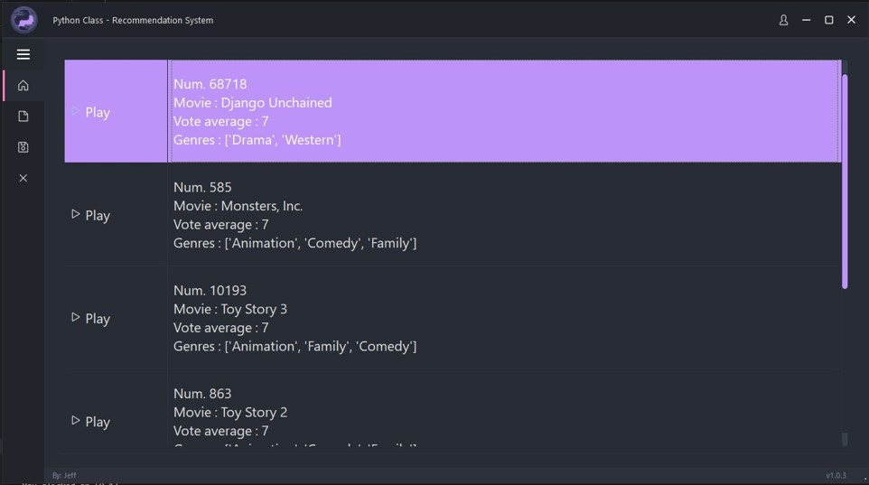
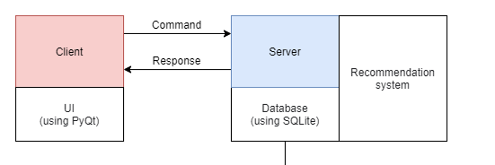
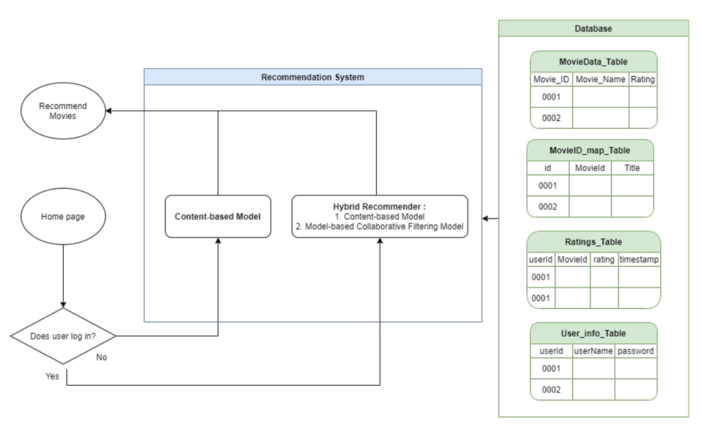
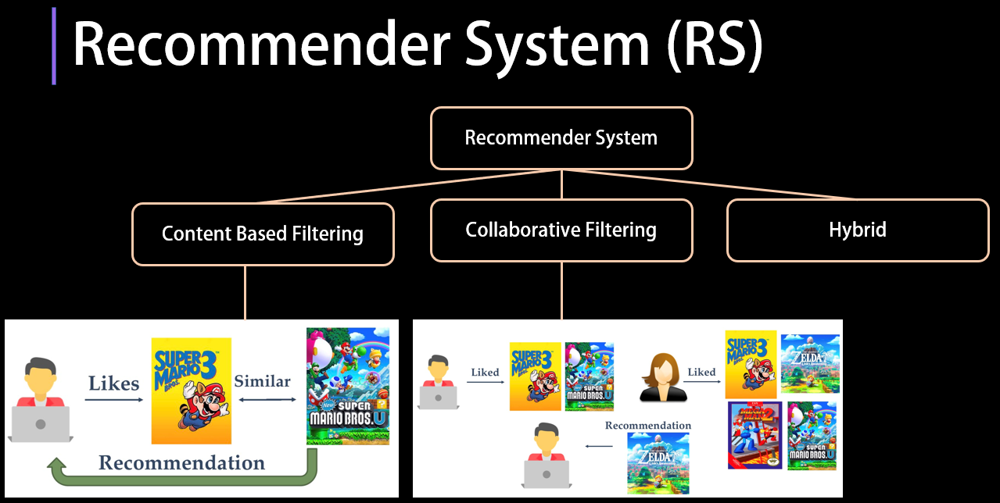
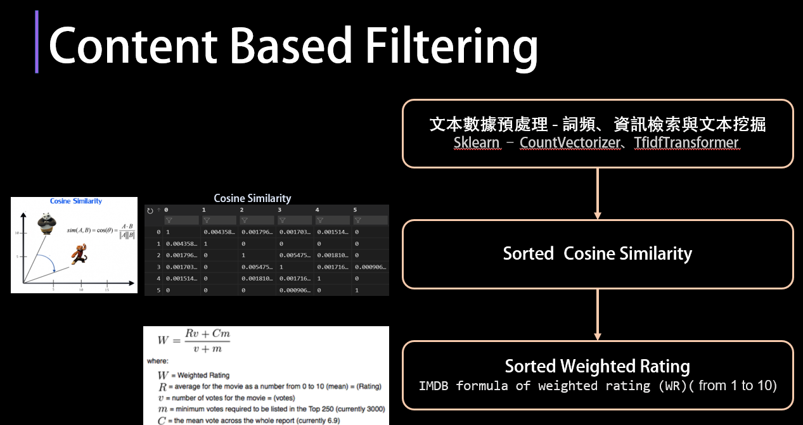
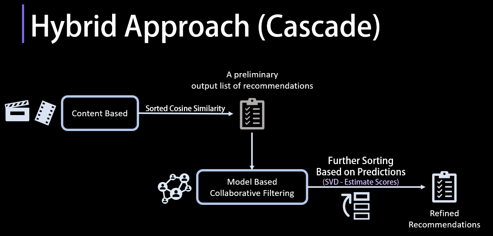
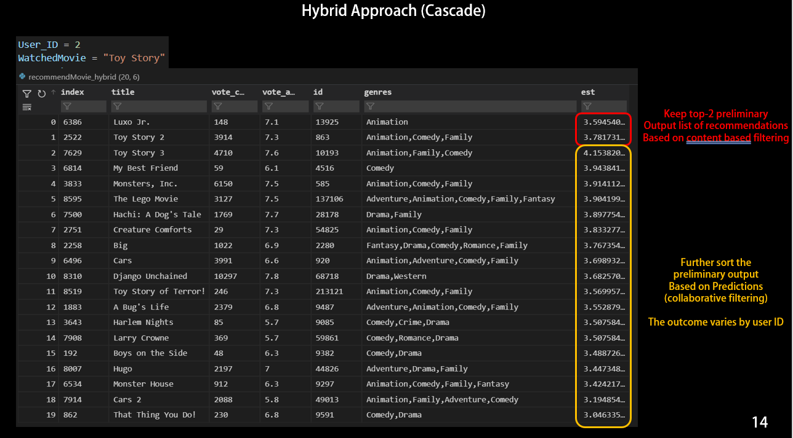

# :clapper:Python Final Project - Movie Recommender System 電影推薦系統 #

# :heart: YouTube - Project Presentation and Demo
Presentation and demo by 謝尚泓 Shang-Hong Xie and 陳良葳 Jeff.
> 🔗 https://www.youtube.com/watch?v=aSEBuPXpsd4

## :dart: Introduction ##
 Recommendation systems are becoming increasingly important in today’s extremely busy world.
 The purpose of a recommendation system basically is to search for content that would be interesting to an individual. 
 Moreover, it involves a number of factors to create personalised lists of useful and interesting content specific to each user/individual. 
 Recommendation systems are Artificial Intelligence based algorithms that skim through all possible options and create a customized list of items that are interesting and relevant to an individual.

 We build a movie recommender system in python, and then our recommender system consists of the basic 3 methods.
 1. Content-Based Filtering
 2. Collaborative Filtering
 3. Hybrid
 The movie dataset is from Kaggle, and we convert the original CSV file to DB file so that we can process the data in SQLite
 
 Kaggle - The Movies Dataset:
> 🔗 https://www.kaggle.com/rounakbanik/the-movies-dataset

 As for GUI, we use PyQt6 to show the Socket Client interface(DB and RS is in Socket Server).
 Therefore User (client) can send a command to the server to request Movie information, user information, recommendation output list, and so on.
 
 

## :dart: System Architecture ##

## :dart: Recommender System ##

